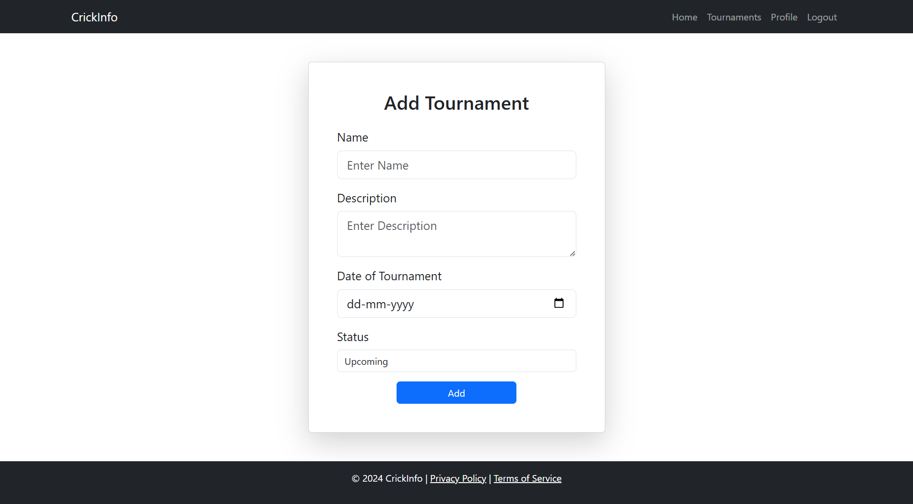
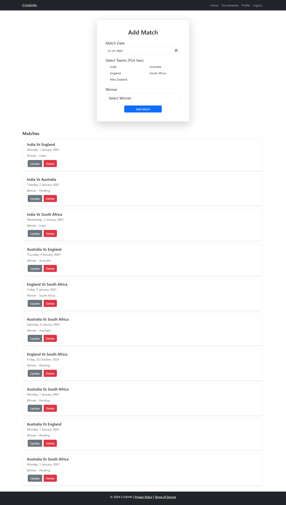
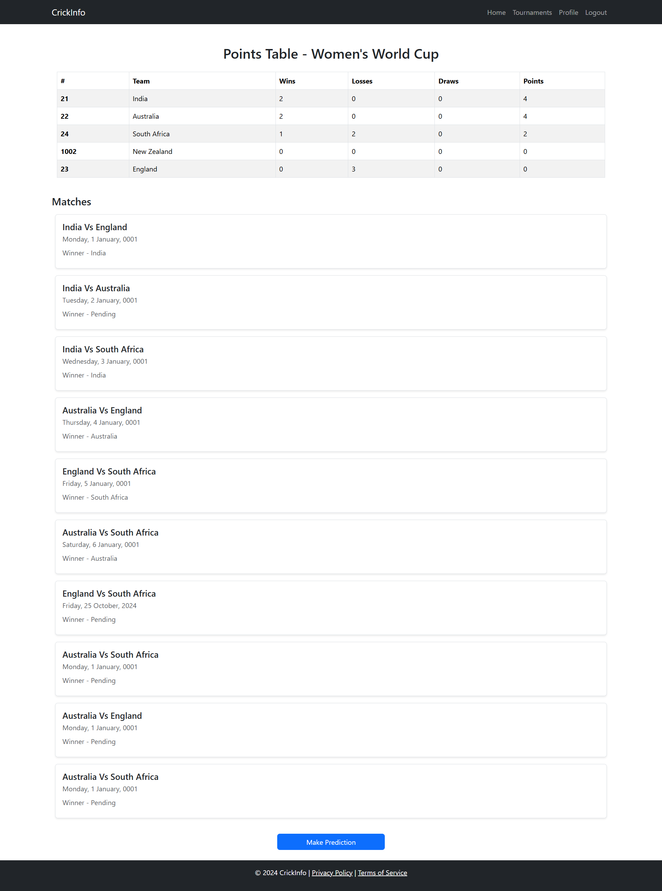

# CrickInfo - Tournament Max Flow Predictor

## Overview
CrickInfo is a web application built with ASP.NET Core MVC and Entity Framework Core that helps cricket teams assess their chances of securing the top position in a tournament's points table. It predicts whether a team can reach the top by using the Max-Flow Algorithm on a constructed bipartite graph representing matches and teams.

## Features
- **Team & Match Management:** Manage teams and matches through an intuitive interface.
- **Max Flow Algorithm:** Simulates if a selected team can top the points table based on remaining matches.
- **Dynamic Points Table:** Automatically updates the points table as results are added.
- **Residual Graph Construction:** Constructs a bipartite graph for analysis.
- **Interactive Prediction:** Visual representation of whether the selected team can top the table.

## Home page

## Tournaments 

## User Profile

## Add tournament

## Add matches

## Tournament details

## Key Components
- **MVC Structure:** Built with the Model-View-Controller pattern.
- **Entity Framework Core:** For database management to store teams, matches, and points data.
- **Max-Flow Algorithm:** Calculates maximum possible flow to predict tournament outcomes.

## Algorithm Explanation
1. **Graph Construction:** Connect matches to participating teams and each team to a sink node.
2. **Edge Capacities:** Each match-to-team edge has a capacity of 1 (win possibility). Team-to-sink edges have capacities based on max possible points.
3. **Max Flow Calculation:** Calculates the maximum flow from source to sink.
4. **Result Interpretation:** If the max-flow is equal to or exceeds the required points, the team can still top the tournament.

